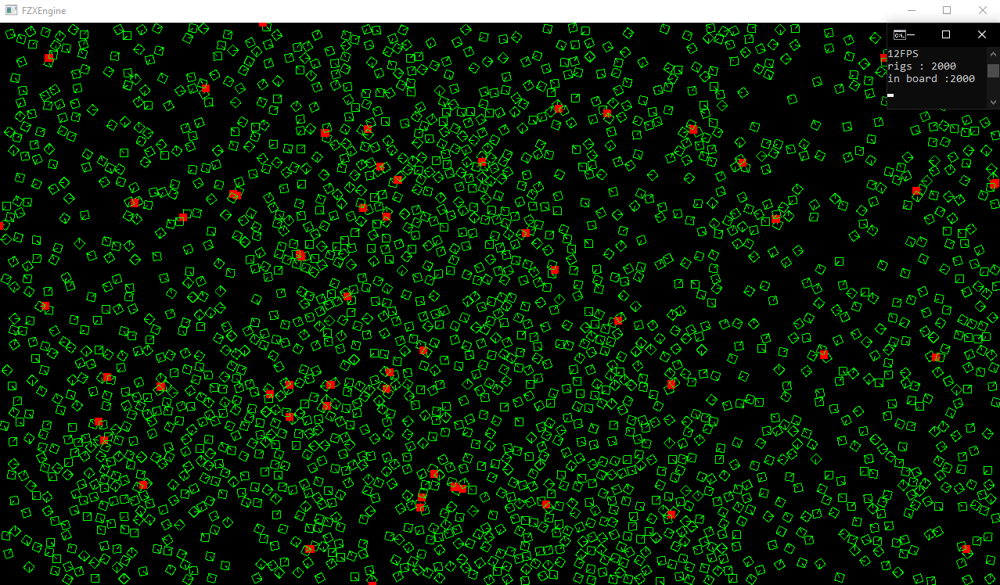

# FZXEngine

FZXEngine is a lightweight **2D physics engine** written in C++.  
It focuses on simulating **rigid bodies, collisions, and physical interactions** in a game-like environment, with a minimal rendering layer for visualization.

---

## Overview

The engine provides:
- A **Physics System** that updates objects with forces, velocity, and acceleration.
- **Collision Detection** using shapes like circles and rectangles, with broadphase (spatial grid) and narrowphase (exact overlap) checks.
- **Collision Resolution** using Minimum Translation Vectors (MTV) and impulse responses to prevent overlap and simulate realistic reactions.
- A **Renderer** that displays objects and their interactions for debugging and demonstrations.

---

## Purpose

This project is not a full physics engine but a foundation for:
- Understanding the fundamentals of **game physics**.
- Experimenting with collision algorithms and resolution methods.
- Serving as a sandbox for building more advanced systems (joints, springs, constraints, etc.).
- Acting as a base to integrate into a future game engine.

---

## Architecture

- **Physics Server** — updates rigid bodies and resolves collisions.
- **Collision System** — performs broadphase (spatial grid) and narrowphase detection (Depends On Shape Type For Fast Detection).
- **Renderer** — minimal OpenGL layer to visualize simulations.
- **Components** — modular pieces like `Transform2D`, `Collision2D`, `Shape2D` etc.

---

## Example Scenarios

With FZXEngine, you can:
- Drop objects with gravity and watch them collide realistically.
- Simulate bouncing balls, falling boxes, and other simple 2D physics interactions.

---

## Whats Messing (Soon Added)

- Stacking Logic For Rig Bodies
- Sleep Logic For Rig Bodies
- Maybe New Renderer
- More Optimization On Algorithms
